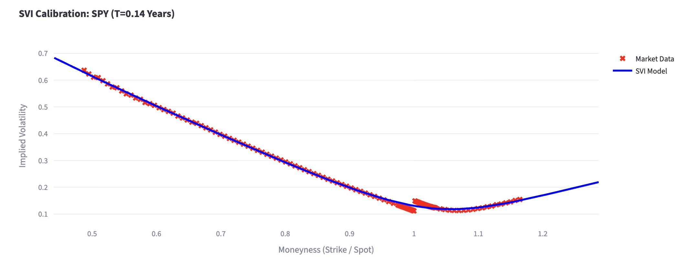
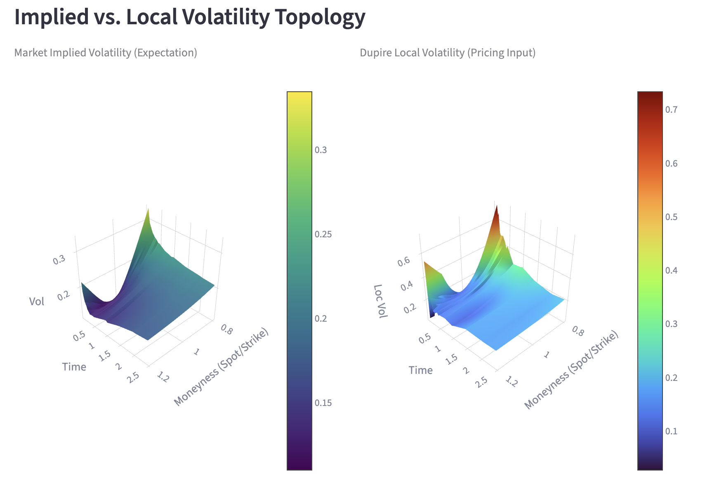

# Volatility Surface Modelling & Pricing Engine

## Project Overview

This project implements an industrial-grade quantitative finance pipeline designed to construct, visualize, and utilize **Implied Volatility Surfaces** for the S&P 500 ETF (SPY).

Going beyond simple interpolation, this engine implements a rigorous **SVI (Stochastic Volatility Inspired)** calibration on real-time market data to ensure arbitrage-free smoothing. It derives the **Local Volatility Surface** using Dupire's formula—adjusted for **Log-Forward Moneyness** coordinates—and employs it in a **Monte Carlo Pricing Engine** to price path-dependent exotic derivatives (specifically Barrier Options) and analyze **Hedging Risks** (Delta Skew).

**Core Objective:** To bridge the gap between raw, noisy market options data and a tradeable, arbitrage-free volatility surface suitable for pricing and hedging.

---

## Key Features

### 1. Robust Data ETL (`src/data_loader.py`)

* **Real-time Connection:** Fetches live Option Chain data via Yahoo Finance API.
* **Smart Cleaning:**
    * **Liquidity Filtering:** Filters quotes based on **Open Interest** and **Volume** to remove stale prices.
    * **Data Hygiene:** Eliminates "dirty data" (e.g., zero-volatility quotes, extreme bid-ask spreads).
    * **Precise Time-Keeping:** Calculates Time-to-Maturity ($T$) using trading calendars, handling intraday granularity.
* **Yield Curve Bootstrapping:** Dynamically bootstraps the risk-free rate curve ($r(t)$) using US Treasury yields (13W, 5Y, 10Y, 30Y) to ensure accurate discounting for long-dated options.

### 2. SVI Calibration Engine (`src/svi_model.py`)

The engine fits the **Raw SVI (Stochastic Volatility Inspired)** parameterization to market implied volatilities for each expiration slice.

* **Why SVI?** Unlike cubic splines, SVI guarantees correct asymptotic behavior in the wings ($|k| \to \infty$), preventing the "wiggling" that causes massive pricing errors in tail risk products.
* **The Formula:**
    $$w(k) = a + b \{ \rho (k - m) + \sqrt{(k - m)^2 + \sigma^2} \}$$
    Where $w(k) = \sigma_{BS}^2 T$ is total variance, and $k$ is log-moneyness.
* **Constrained Optimization:**
    * **Optimizer:** Uses `SLSQP` (Sequential Least SQuares Programming) with **Multi-Start** heuristics to avoid local minima in highly skewed slices.
    * **Arbitrage Enforcement:** Implements **Penalty Functions** to enforce static no-arbitrage constraints (Variance $w > 0$, Slope constraints $|\rho| < 1$).

> **Visual Proof:** The model fits the raw market data (red crosses) with high precision, ensuring a smooth, arbitrage-free curve (blue line) even in the presence of noise.
>
> 
>
> *Figure 1: Real-time SVI model calibration against SPY market data (T=0.14 Years). Note the tight fit in the liquid region and stable extrapolation in the wings.*

### 3. Surface Construction & Local Volatility (`src/vol_surface.py`)

This module transforms the 2D SVI slices into a coherent 3D Implied Volatility Surface and extracts the Local Volatility Surface $\sigma_{loc}(S,t)$.

* **Coordinate System Transformation :**
    * Instead of Spot Moneyness ($K/S$), the engine internally converts all coordinates to **Log-Forward Moneyness**:
        $$y = \ln\left(\frac{K}{F_T}\right) = \ln\left(\frac{K}{S_0 e^{(r-q)T}}\right)$$
    * **Why?** This absorbs the drift terms ($r-q$), significantly simplifying Dupire's formula and making the surface invariant to interest rate shifts.
* **Dupire’s Local Volatility:**
    * Implements **Gatheral’s formulation** of Dupire in terms of Total Variance $w$.
    * **Numerical Derivatives:** Uses central finite differences on the dense interpolated grid to compute partial derivatives $\frac{\partial w}{\partial T}$ and $\frac{\partial w}{\partial y}$.

> **Topology Comparison:** While the Implied Volatility surface (left) represents market *expectations*, the Local Volatility surface (right) represents *instantaneous* volatility. Notice how Local Vol exhibits steeper skew and sharper features—this is the "leverage effect" (volatility increasing as spot drops) crucial for pricing barriers accurately.
>
> 
>
> *Figure 2: 3D Visualization showing the structural differences between the smooth Implied Volatility Surface and the resulting Local Volatility Surface.*

### 4. Exotic Pricing Engine (`src/pricer.py`)

* **Monte Carlo Simulation:** Simulates 50,000+ asset price paths using Geometric Brownian Motion with Local Volatility.
    $$dS_t = (r_t - q)S_t dt + \sigma_{loc}(S_t, t) S_t dW_t$$
* **Sticky Local Volatility:** The pricer performs a vectorized lookup on the pre-computed Local Volatility grid at every time step $(S_t, t)$, ensuring the smile dynamics are respected.
* **Barrier Option Pricing:**
    * Prices **Down-and-Out Call** options.
    * **Model Comparison:** Calculates the spread between the **Local Vol Price** and **Black-Scholes Price**, quantifying the "Model Risk" hidden in flat-volatility assumptions.

### 5. Risk Management & Hedging Analysis

* **Finite Difference Greeks:** Calculates Delta ($\Delta$) via "Bump and Revalue" method using **Common Random Numbers (CRN)** to minimize variance.
* **Delta Skew Profiling:**
    * Visualizes how the hedge ratio changes as the spot price approaches the barrier.

> **Hedging Insight:** The chart below demonstrates critical Model Risk. As the Spot Price drops towards the Barrier ($583), the **Local Vol Delta (Red)** behaves aggressively, often exceeding 1.0 or dropping sharply due to the volatility spike. A trader hedging with **BS Delta (Gray)** would be significantly under-hedged against the crash risk.
>
> 
>
> *Figure 3: Comparison of Hedging Ratios (Delta) between Black-Scholes and Local Volatility models as the asset price approaches the Knock-Out Barrier.*

### 6. Interactive Dashboard (`app.py`)

* **Tech Stack:** Streamlit + Plotly.
* **Capabilities:**
    * Real-time 3D surface rotation and inspection.
    * Interactive "Pricing Playground" to test different Strikes, Barriers, and Maturities.
    * Live view of calibration error (RMSE) and arbitrage constraints.

---

## Project Structure

```text
volatility-surface-modelling/
├── src/
│   ├── __init__.py         # Package initializer
│   ├── data_loader.py      # ETL: Yahoo Finance API, Cleaning, Yield Curve 
│   ├── rates.py            # RateProvider: US Treasury Interpolation
│   ├── svi_model.py        # Optimizer: Raw SVI Parametrization & Penalty 
│   ├── vol_surface.py      # Mathematics: Log-Forward Coords, SVI 
│   └── pricer.py           # Engine: Monte Carlo Simulation & Greeks 
├── images/                 # Documentation assets
│   ├── svi_calibration_fit.png
│   ├── vol_surface_topology.png
│   └── delta_skew_profile.png
├── app.py                  # Streamlit Frontend Entry Point
├── demo.ipynb              # Jupyter Notebook for Step-by-Step Research 
├── requirements.txt        # Python dependencies
└── README.md               # Documentation

```

---

## Quick Start

### Prerequisites

* Python 3.8+
* Pip or Conda

### Installation

1. **Clone the repository:**
```bash
git clone https://github.com/ericwang0321/volatility-surface-modelling.git
cd volatility-surface-modelling
```


2. **Install dependencies:**
```bash
pip install -r requirements.txt
```


### How to Run

**Option 1: Interactive Dashboard**
To explore the data, surfaces, and pricing engine via a web interface:

```bash
streamlit run app.py
```

**Option 2: Jupyter Notebook Walkthrough**
For a transparent, code-first walkthrough of the entire quantitative pipeline (without launching the web UI), refer to `demo.ipynb`. This notebook is designed for research and code review, allowing you to step through the logic block-by-block.

---

## Technical Deep Dive: Why This Architecture?

### 1. Handling the "Smile" with SVI

Standard polynomial interpolation of implied volatility often leads to **arbitrage** (negative probability density) in the wings. We use SVI because it is **asymptotically linear**, which is consistent with the Heston model and ensures no static arbitrage exists if parameters are constrained correctly. Our implementation explicitly penalizes parameters that violate density constraints.

### 2. Log-Forward Moneyness for Dupire

Implementing Dupire's formula using standard Spot Moneyness () is numerically unstable when interest rates are non-zero, requiring complex drift-adjustment terms. By transforming the surface to **Log-Forward Moneyness** () before calibration:

1. We remove the drift term  from the partial differential equation.
2. The SVI fit becomes more symmetric and robust.
3. The extraction of  becomes purely a function of the shape of the surface, decoupled from the discount curve.

### 3. Hedging the "Crash" Risk

In Equity markets, the Skew is negative (Spot , Vol ). A simple Black-Scholes model assumes Vol is constant.

* **Scenario:** If SPY drops 10%, a BS model assumes Vol stays at 15%. Our Local Vol model knows (via the surface) that Vol will spike to 25%.
* **Result:** The Local Vol model assigns a higher probability to hitting the Down-and-Out Barrier, resulting in a **lower** theoretical price for the option compared to BS. This project empirically proves this behavior and visualizes the resulting **Delta Skew**.

---

## Roadmap

* [x] Phase 1: Real-time Data ETL & Yield Curve Bootstrapping
* [x] Phase 2: Arbitrage-Free SVI Calibration (Raw SVI + SLSQP)
* [x] Phase 3: Log-Forward Coordinate Transformation
* [x] Phase 4: Local Volatility (Dupire) Extraction
* [x] Phase 5: Monte Carlo Pricing Engine for Exotics (Down-and-Out)
* [x] Phase 6: Greeks Analysis (Delta Skew)
* [ ] Future: Implement SSVI (Surface SVI) for guaranteed calendar arbitrage freedom.
* [ ] Future: Add Heston Model Calibration (Stochastic Volatility).