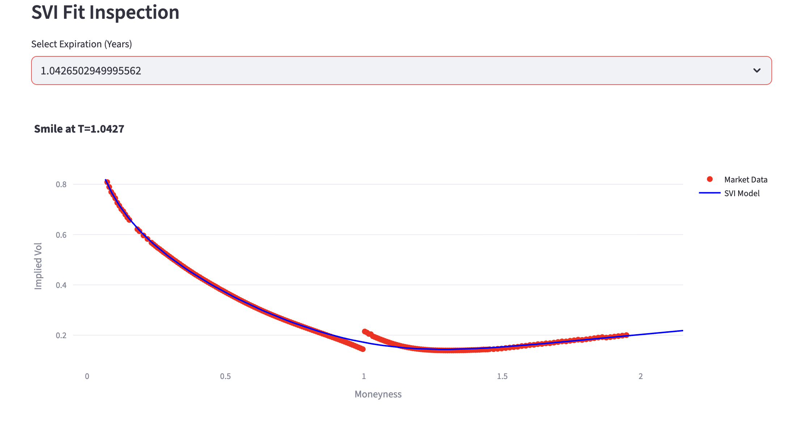
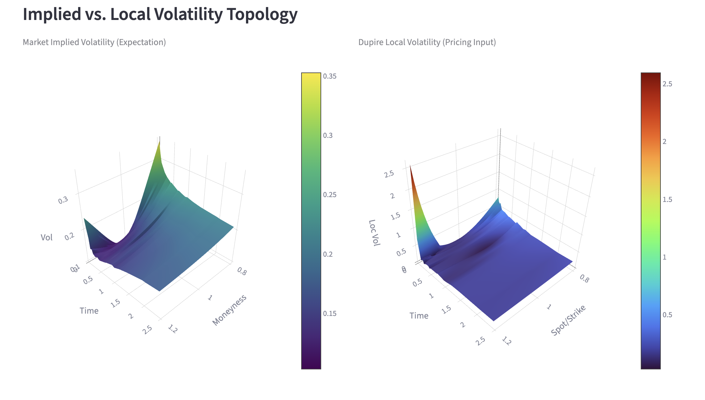

# Volatility Surface Modelling & Pricing Engine

## Project Overview

This project is an industrial-grade quantitative finance pipeline designed to construct, visualize, and utilize **Implied Volatility Surfaces** for the S&P 500 ETF (SPY).

Going beyond simple interpolation, this engine implements a rigorous **SVI (Stochastic Volatility Inspired)** calibration on real-time market data to ensure arbitrage-free smoothing. It then derives the **Local Volatility Surface** using Dupire's formula and employs it in a **Monte Carlo Pricing Engine** to price exotic derivatives (specifically Barrier Options) and analyze **Hedging Risks**.

**Core Objective:** To bridge the gap between raw, noisy market options data and a tradeable volatility surface suitable for pricing and hedging path-dependent exotics.

---
## Key Features

### 1. Robust Data ETL (src/data_loader.py)

* **Real-time Connection:** Fetches live Option Chain data via Yahoo Finance API.
* **Smart Cleaning:**
    * Filters for liquidity using **Open Interest** and Volume checks.
    * Eliminates "dirty data" (e.g., zero-volatility quotes) to prevent model distortion.
    * Precisely calculates Time-to-Maturity ($T$) using trading calendars.
* **Rate Bootstrapping:** Dynamically fetches the risk-free rate ($r$) using the 13-Week Treasury Bill (`^IRX`) as a proxy.

### 2. SVI Calibration Engine (src/svi_model.py)

* Implements the **Raw SVI Parameterization** model to fit volatility smiles for each expiration slice.
* **Optimization:** Uses `scipy.optimize` with bounded constraints to ensure model stability ($b > 0$, $|\rho| < 1$, $\sigma > 0$).
* **Formula:**
    $$w(k) = a + b \left\lbrace \rho(k - m) + \sqrt{(k - m)^2 + \sigma^2} \right\rbrace$$
    *Where $w$ is total variance ($\sigma_{BS}^2 T$) and $k$ is log-moneyness.*
    
> **Visual Proof:** The model fits the raw market data (red dots) with high precision, ensuring a smooth, arbitrage-free curve (blue line).
>
> 
>
> *Figure 1: Snapshot taken directly from the interactive Streamlit dashboard (`app.py`), showing real-time SVI model calibration against market data.*

### 3. Surface Construction & Local Volatility (src/vol_surface.py)

* **Implied Volatility Surface:** Constructs a dense grid by linearly interpolating Total Variance ($w$) in the time dimension.
* **Dupire's Local Volatility:** Implements **Finite Difference** methods to numerically calculate partial derivatives ($\frac{\partial w}{\partial T}$, $\frac{\partial w}{\partial k}$) and extract the instantaneous Local Volatility surface $\sigma_{loc}(S, t)$.

> **Topology Comparison:** Notice how the Local Volatility surface (right) exhibits steeper skew and sharper features compared to the smoother Implied Volatility surface (left), capturing the instantaneous crash risk.
>
> 
>
> *Figure 2: 3D Visualization generated by the project's dashboard (`app.py`), illustrating the structural differences between Implied and Local Volatility.*

### 4. Exotic Pricing Engine (src/pricer.py)

* **Monte Carlo Simulation:** Simulates 10,000+ asset price paths using Geometric Brownian Motion.
* **Dynamic Volatility:** Supports path generation using **Local Volatility** lookup (surface interpolation) at each time step.
* **Barrier Option Pricing:** Prices **Down-and-Out Call** options and compares results against Black-Scholes (Constant Vol) to demonstrate **Model Risk**.

### 5. Risk Management & Hedging Analysis

* **Delta Profiling:** Calculates the option's Delta ($\Delta$) across a range of spot prices using Finite Difference methods ("Bump and Revalue").
* **Hedge Effectiveness:** Visualizes the divergence between **Black-Scholes Delta** and **Local Volatility Delta** near barrier levels, highlighting the "Delta Skew" risk that leads to under-hedging or over-hedging in static models.

### 6. Interactive Dashboard (app.py)

* **3D Visualization:** Fully interactive Plotly 3D surfaces for both Implied and Local Volatility.
* **Pricing Playground:** Real-time Monte Carlo simulation runner with adjustable parameters.
* **Hedging Analysis Module:** Interactive chart comparing Delta profiles of different models.

---

## Project Structure

```text
volatility-surface-modelling/
├── src/                    # Core Quantitative Library
│   ├── __init__.py         # Package initializer
│   ├── data_loader.py      # ETL pipeline for options data
│   ├── rates.py            # Risk-free rate service
│   ├── svi_model.py        # SVI calibration logic (Optimizer)
│   ├── vol_surface.py      # Surface construction & Dupire Local Vol
│   └── pricer.py           # Monte Carlo Pricing & Greeks Engine
├── images/                 # Documentation assets
├── app.py                  # Streamlit Frontend Entry Point
├── demo.ipynb              # Standalone Pipeline Walkthrough
├── requirements.txt        # Python dependencies
└── README.md               # Documentation

```

---

## Quick Start

### Prerequisites

* Python 3.8+
* Pip or Conda

### Installation

1. **Clone the repository:**
```bash
git clone https://github.com/ericwang0321/volatility-surface-modelling.git
cd volatility-surface-modelling
```


2. **Install dependencies:**
```bash
pip install -r requirements.txt
```


### How to Run

**Option 1: Interactive Dashboard**
To explore the data, surfaces, and pricing engine via a web interface:

```bash
streamlit run app.py
```

**Option 2: Jupyter Notebook Walkthrough**
For a transparent, code-first walkthrough of the entire quantitative pipeline (without launching the web UI), refer to `demo.ipynb`. This notebook is designed for research and code review, allowing you to step through the logic block-by-block.

* Run via VS Code : Open `demo.ipynb` and click "Run All".

---

## Methodology Highlight

### Why SVI?

We chose the **SVI (Stochastic Volatility Inspired)** parameterization for implied volatility smoothing because:

1. **Asymptotic Behavior:** SVI ensures linear variance in the wings (), preventing wild oscillations common in polynomial fits.
2. **Arbitrage Constraints:** Parameters can be constrained to ensure the density function remains positive (no static arbitrage).

### Why Local Volatility?

While Implied Volatility represents the market's *average* expectation, **Local Volatility** represents the *instantaneous* volatility at a specific spot and time.

* **Dupire's Formula:** By extracting Local Volatility from the calibrated surface, we can price **Barrier Options** more accurately.
* **Skew Impact:** The model captures the "Leverage Effect"—where local volatility spikes as the asset price drops—leading to more realistic pricing of Down-and-Out options compared to the flat Black-Scholes model.

---

## Roadmap

* Phase 1: Data ETL & Cleaning (Completed)
* Phase 2: SVI Calibration & Implied Vol Surface (Completed)
* Phase 3: Local Volatility (Dupire) Extraction (Completed)
* Phase 4: Monte Carlo Pricing Engine for Exotics (Completed)
* Phase 5: Dashboard & Visualization (Completed)
* Phase 6: Hedging & Greeks Analysis (Delta Profile) (Completed)
* Future: Implement Heston Stochastic Volatility Model calibration.
* Future: Add Gamma and Vega bucketing for PnL attribution.